~~You can now [find us at CVPR 2020](http://cvpr20.com/event/rethinking-depthwise-separable-convolutions-how-intra-kernel-correlations-lead-to-improved-mobilenets/). Our live Q&A sessions are on [June 18, 2020 @ 5pm - 7pm PDT](https://everytimezone.com/s/2c61ec42) [(click here to join)](http://cvpr20.com/event/rethinking-depthwise-separable-convolutions-how-intra-kernel-correlations-lead-to-improved-mobilenets/) and [June 19, 2020 @ 5am - 7am PDT](https://everytimezone.com/s/99be4dea) [(click here to join)](http://cvpr20.com/event/rethinking-depthwise-separable-convolutions-how-intra-kernel-correlations-lead-to-improved-mobilenets2nd-time/). We are looking forward to seeing you at CVPR!~~

***CVPR 2020 is now over, and we thank you for all the interesting discussions! Our presentation video is [available on YouTube](https://www.youtube.com/watch?v=nC6C-74xmbY). We will continue the development of the code and models in this repository, so stay tuned!***

---

Blueprint Separable Convolutions (BSConv)
=========================================

This repository provides code and trained models for the CVPR 2020 paper ([official](http://openaccess.thecvf.com/content_CVPR_2020/html/Haase_Rethinking_Depthwise_Separable_Convolutions_How_Intra-Kernel_Correlations_Lead_to_Improved_CVPR_2020_paper.html), [arXiv](https://arxiv.org/abs/2003.13549)):

> **Rethinking Depthwise Separable Convolutions: How Intra-Kernel Correlations Lead to Improved MobileNets**
>
> Daniel Haase\*, Manuel Amthor\*

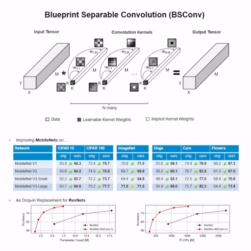

Table of Contents
-----------------

1. [Overview](#blueprint-separable-convolutions-bsconv)
2. [Results](#results)
    1. [CIFAR10 - MobileNetV1](#cifar10---mobilenetv1)
    2. [CIFAR10 - MobileNetV2](#cifar10---mobilenetv2)
    3. [CIFAR10 - MobileNetV3-small](#cifar10---mobilenetv3-small)
    4. [CIFAR10 - MobileNetV3-large](#cifar10---mobilenetv3-large)
    5. [CIFAR10 - WRN-16](#cifar10---wideresnets-wrn-16)
    6. [CIFAR10 - WRN-28](#cifar10---wideresnets-wrn-28)
    7. [CIFAR10 - WRN-40](#cifar10---wideresnets-wrn-40)
    8. [CIFAR100 - MobileNetV1](#cifar100---mobilenetv1)
    9. [CIFAR100 - MobileNetV2](#cifar100---mobilenetv2)
    10. [CIFAR100 - MobileNetV3-small](#cifar100---mobilenetv3-small)
    11. [CIFAR100 - MobileNetV3-large](#cifar100---mobilenetv3-large)
    12. [CIFAR100 - ResNets](#cifar100---resnets)
    13. [CIFAR100 - WRN-16](#cifar100---wideresnets-wrn-16)
    14. [CIFAR100 - WRN-28](#cifar100---wideresnets-wrn-28)
    15. [CIFAR100 - WRN-40](#cifar100---wideresnets-wrn-40)
3. [Requirements](#requirements)
4. [Installation](#installation)
5. [Usage](#usage)
6. [Change Log](#change-log)
7. [Citation](#citation)

Results
-------

### CIFAR10 - MobileNetV1

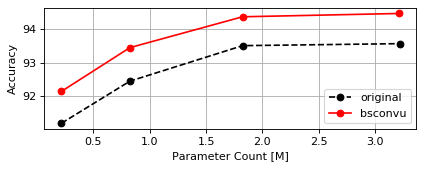
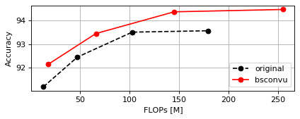

| Model                            |   Accuracy (top-1) |   Params [M] |   FLOPs [M] |
|:---------------------------------|-------------------:|-------------:|------------:|
| `cifar_mobilenetv1_w1`           |              93.57 |         3.22 |      179.34 |
| `cifar_mobilenetv1_w3d4`         |              93.51 |         1.82 |      102.66 |
| `cifar_mobilenetv1_w1d2`         |              92.44 |         0.82 |       47.21 |
| `cifar_mobilenetv1_w1d4`         |              91.17 |         0.22 |       12.99 |
|                                  |                    |              |             |
| `cifar_mobilenetv1_w1_bsconvu`   |              94.48 |         3.22 |      254.64 |
| `cifar_mobilenetv1_w3d4_bsconvu` |              94.38 |         1.82 |      144.98 |
| `cifar_mobilenetv1_w1d2_bsconvu` |              93.45 |         0.82 |       65.98 |
| `cifar_mobilenetv1_w1d4_bsconvu` |              92.13 |         0.22 |       17.66 |

### CIFAR10 - MobileNetV2

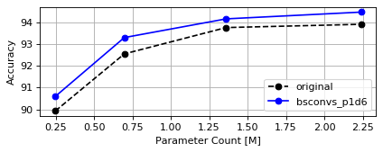
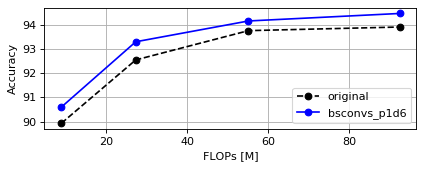

| Model                                 |   Accuracy (top-1) |   Params [M] |   FLOPs [M] |
|:--------------------------------------|-------------------:|-------------:|------------:|
| `cifar_mobilenetv2_w1`                |              93.91 |         2.24 |       92.40 |
| `cifar_mobilenetv2_w3d4`              |              93.76 |         1.36 |       55.13 |
| `cifar_mobilenetv2_w1d2`              |              92.55 |         0.70 |       27.32 |
| `cifar_mobilenetv2_w1d4`              |              89.93 |         0.25 |        8.97 |
|                                       |                    |              |             |
| `cifar_mobilenetv2_w1_bsconvs_p1d6`   |              94.47 |         2.24 |       92.40 |
| `cifar_mobilenetv2_w3d4_bsconvs_p1d6` |              94.16 |         1.36 |       55.13 |
| `cifar_mobilenetv2_w1d2_bsconvs_p1d6` |              93.30 |         0.70 |       27.32 |
| `cifar_mobilenetv2_w1d4_bsconvs_p1d6` |              90.60 |         0.25 |        8.97 |

### CIFAR10 - MobileNetV3-small

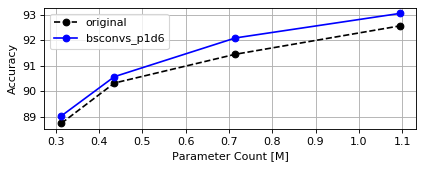
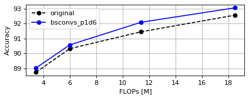

| Model                                        |   Accuracy (top-1) |   Params [M] |   FLOPs [M] |
|:---------------------------------------------|-------------------:|-------------:|------------:|
| `cifar_mobilenetv3_small_w1`                 |              92.57 |         1.09 |       18.48 |
| `cifar_mobilenetv3_small_w3d4`               |              91.46 |         0.72 |       11.40 |
| `cifar_mobilenetv3_small_w1d2`               |              90.33 |         0.44 |        6.00 |
| `cifar_mobilenetv3_small_w7d20`              |              88.75 |         0.31 |        3.45 |
|                                              |                    |              |             |
| `cifar_mobilenetv3_small_w1_bsconvs_p1d6`    |              93.06 |         1.09 |       18.48 |
| `cifar_mobilenetv3_small_w3d4_bsconvs_p1d6`  |              92.10 |         0.72 |       11.40 |
| `cifar_mobilenetv3_small_w1d2_bsconvs_p1d6`  |              90.58 |         0.44 |        6.00 |
| `cifar_mobilenetv3_small_w7d20_bsconvs_p1d6` |              89.04 |         0.31 |        3.45 |

### CIFAR10 - MobileNetV3-large

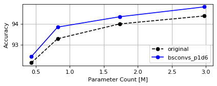
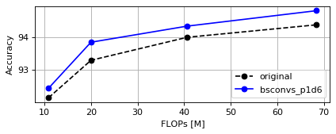

| Model                                        |   Accuracy (top-1) |   Params [M] |   FLOPs [M] |
|:---------------------------------------------|-------------------:|-------------:|------------:|
| `cifar_mobilenetv3_large_w1`                 |              94.38 |         2.98 |       68.45 |
| `cifar_mobilenetv3_large_w3d4`               |              94.00 |         1.73 |       40.67 |
| `cifar_mobilenetv3_large_w1d2`               |              93.30 |         0.82 |       20.00 |
| `cifar_mobilenetv3_large_w7d20`              |              92.16 |         0.44 |       10.89 |
|                                              |                    |              |             |
| `cifar_mobilenetv3_large_w1_bsconvs_p1d6`    |              94.81 |         2.98 |       68.45 |
| `cifar_mobilenetv3_large_w3d4_bsconvs_p1d6`  |              94.34 |         1.73 |       40.67 |
| `cifar_mobilenetv3_large_w1d2_bsconvs_p1d6`  |              93.85 |         0.82 |       20.00 |
| `cifar_mobilenetv3_large_w7d20_bsconvs_p1d6` |              92.45 |         0.44 |       10.89 |

### CIFAR10 - WideResNets (WRN-16)


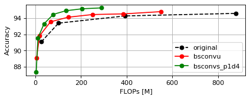

| Model                         |   Accuracy (top-1) |   Params [M] |   FLOPs [M] |
|:------------------------------|-------------------:|-------------:|------------:|
| `cifar_wrn16_1`               |              91.11 |         0.18 |       27.06 |
| `cifar_wrn16_2`               |              93.40 |         0.69 |      101.86 |
| `cifar_wrn16_4`               |              94.29 |         2.75 |      394.06 |
| `cifar_wrn16_6`               |              94.60 |         6.17 |      877.10 |
| `cifar_wrn16_8`               |              95.05 |        10.96 |     1550.99 |
| `cifar_wrn16_10`              |              95.03 |        17.12 |     2415.71 |
| `cifar_wrn16_12`              |              95.11 |        24.64 |     3471.28 |
|                               |                    |              |             |
| `cifar_wrn16_1_bsconvu`       |              89.09 |         0.03 |        5.57 |
| `cifar_wrn16_2_bsconvu`       |              91.83 |         0.10 |       18.74 |
| `cifar_wrn16_4_bsconvu`       |              93.56 |         0.36 |       66.59 |
| `cifar_wrn16_6_bsconvu`       |              94.13 |         0.80 |      143.80 |
| `cifar_wrn16_8_bsconvu`       |              94.46 |         1.41 |      250.38 |
| `cifar_wrn16_10_bsconvu`      |              94.54 |         2.19 |      386.31 |
| `cifar_wrn16_12_bsconvu`      |              94.82 |         3.13 |      551.60 |
|                               |                    |              |             |
| `cifar_wrn16_1_bsconvs_p1d4`  |              87.34 |         0.02 |        4.01 |
| `cifar_wrn16_2_bsconvs_p1d4`  |              91.56 |         0.06 |       11.85 |
| `cifar_wrn16_4_bsconvs_p1d4`  |              93.31 |         0.21 |       38.00 |
| `cifar_wrn16_6_bsconvs_p1d4`  |              94.48 |         0.46 |       78.84 |
| `cifar_wrn16_8_bsconvs_p1d4`  |              94.93 |         0.80 |      134.35 |
| `cifar_wrn16_10_bsconvs_p1d4` |              95.17 |         1.23 |      204.55 |
| `cifar_wrn16_12_bsconvs_p1d4` |              95.28 |         1.75 |      289.42 |

### CIFAR10 - WideResNets (WRN-28)

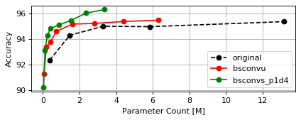
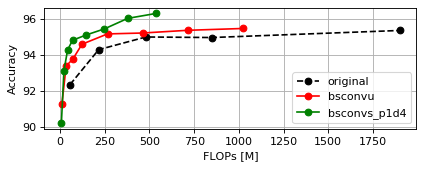

| Model                         |   Accuracy (top-1) |   Params [M] |   FLOPs [M] |
|:------------------------------|-------------------:|-------------:|------------:|
| `cifar_wrn28_1`               |              92.36 |         0.37 |       55.72 |
| `cifar_wrn28_2`               |              94.29 |         1.47 |      215.79 |
| `cifar_wrn28_3`               |              94.99 |         3.29 |      479.94 |
| `cifar_wrn28_4`               |              94.96 |         5.85 |      848.42 |
| `cifar_wrn28_6`               |              95.35 |        13.14 |     1898.38 |
| `cifar_wrn28_8`               |              95.73 |        23.35 |     3365.68 |
| `cifar_wrn28_10`              |              95.72 |        36.48 |     5250.31 |
| `cifar_wrn28_12`              |              95.54 |        52.52 |     7552.27 |
|                               |                    |              |             |
| `cifar_wrn28_1_bsconvu`       |              91.28 |         0.05 |       10.09 |
| `cifar_wrn28_2_bsconvu`       |              93.39 |         0.19 |       34.08 |
| `cifar_wrn28_3_bsconvu`       |              93.77 |         0.42 |       71.44 |
| `cifar_wrn28_4_bsconvu`       |              94.59 |         0.73 |      122.43 |
| `cifar_wrn28_6_bsconvu`       |              95.16 |         1.61 |      265.31 |
| `cifar_wrn28_8_bsconvu`       |              95.21 |         2.82 |      462.71 |
| `cifar_wrn28_10_bsconvu`      |              95.36 |         4.39 |      714.64 |
| `cifar_wrn28_12_bsconvu`      |              95.46 |         6.29 |     1021.10 |
|                               |                    |              |             |
| `cifar_wrn28_1_bsconvs_p1d4`  |              90.22 |         0.04 |        7.25 |
| `cifar_wrn28_2_bsconvs_p1d4`  |              93.13 |         0.12 |       21.47 |
| `cifar_wrn28_3_bsconvs_p1d4`  |              94.28 |         0.24 |       42.23 |
| `cifar_wrn28_4_bsconvs_p1d4`  |              94.81 |         0.41 |       69.82 |
| `cifar_wrn28_6_bsconvs_p1d4`  |              95.10 |         0.88 |      145.44 |
| `cifar_wrn28_8_bsconvs_p1d4`  |              95.44 |         1.53 |      248.32 |
| `cifar_wrn28_10_bsconvs_p1d4` |              96.02 |         2.36 |      378.46 |
| `cifar_wrn28_12_bsconvs_p1d4` |              96.29 |         3.37 |      535.87 |

### CIFAR10 - WideResNets (WRN-40)


| Model                         |   Accuracy (top-1) |   Params [M] |   FLOPs [M] |
|:------------------------------|-------------------:|-------------:|------------:|
| `cifar_wrn40_1`               |              93.30 |         0.56 |       84.37 |
| `cifar_wrn40_2`               |              94.44 |         2.24 |      329.73 |
| `cifar_wrn40_3`               |              95.03 |         5.04 |      735.78 |
| `cifar_wrn40_4`               |              95.36 |         8.95 |     1302.78 |
| `cifar_wrn40_6`               |              95.63 |        20.12 |     2919.66 |
| `cifar_wrn40_8`               |              95.58 |        35.75 |     5180.37 |
| `cifar_wrn40_10`              |              95.66 |        55.84 |     8084.90 |
|                               |                    |              |             |
| `cifar_wrn40_1_bsconvu`       |              92.07 |         0.08 |       14.61 |
| `cifar_wrn40_2_bsconvu`       |              93.91 |         0.29 |       49.41 |
| `cifar_wrn40_3_bsconvu`       |              94.65 |         0.63 |      103.88 |
| `cifar_wrn40_4_bsconvu`       |              94.80 |         1.09 |      178.27 |
| `cifar_wrn40_6_bsconvu`       |              95.20 |         2.41 |      386.81 |
| `cifar_wrn40_8_bsconvu`       |              95.54 |         4.24 |      675.05 |
| `cifar_wrn40_10_bsconvu`      |              95.83 |         6.59 |     1042.98 |
|                               |                    |              |             |
| `cifar_wrn40_1_bsconvs_p1d4`  |              91.24 |         0.05 |       10.49 |
| `cifar_wrn40_2_bsconvs_p1d4`  |              93.55 |         0.17 |       31.08 |
| `cifar_wrn40_3_bsconvs_p1d4`  |              94.64 |         0.36 |       61.38 |
| `cifar_wrn40_4_bsconvs_p1d4`  |              94.98 |         0.61 |      101.64 |
| `cifar_wrn40_6_bsconvs_p1d4`  |              95.66 |         1.31 |      212.04 |
| `cifar_wrn40_8_bsconvs_p1d4`  |              95.74 |         2.27 |      362.29 |
| `cifar_wrn40_10_bsconvs_p1d4` |              96.00 |         3.50 |      552.38 |

### CIFAR100 - MobileNetV1

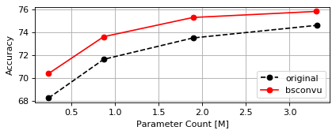
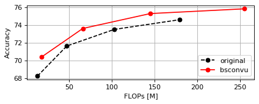

| Model                            |   Accuracy (top-1) |   Params [M] |   FLOPs [M] |
|:---------------------------------|-------------------:|-------------:|------------:|
| `cifar_mobilenetv1_w1`           |              74.58 |         3.31 |      179.43 |
| `cifar_mobilenetv1_w3d4`         |              73.48 |         1.89 |      102.72 |
| `cifar_mobilenetv1_w1d2`         |              71.61 |         0.87 |       47.25 |
| `cifar_mobilenetv1_w1d4`         |              68.23 |         0.24 |       13.01 |
|                                  |                    |              |             |
| `cifar_mobilenetv1_w1_bsconvu`   |              75.80 |         3.31 |      254.73 |
| `cifar_mobilenetv1_w3d4_bsconvu` |              75.27 |         1.89 |      145.04 |
| `cifar_mobilenetv1_w1d2_bsconvu` |              73.59 |         0.87 |       66.03 |
| `cifar_mobilenetv1_w1d4_bsconvu` |              70.37 |         0.24 |       17.68 |

### CIFAR100 - MobileNetV2

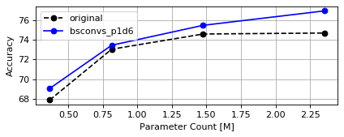
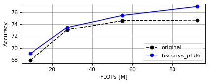

| Model                                 |   Accuracy (top-1) |   Params [M] |   FLOPs [M] |
|:--------------------------------------|-------------------:|-------------:|------------:|
| `cifar_mobilenetv2_w1`                |              74.67 |         2.35 |       92.51 |
| `cifar_mobilenetv2_w3d4`              |              74.57 |         1.48 |       55.24 |
| `cifar_mobilenetv2_w1d2`              |              73.03 |         0.81 |       27.43 |
| `cifar_mobilenetv2_w1d4`              |              67.89 |         0.36 |        9.08 |
|                                       |                    |              |             |
| `cifar_mobilenetv2_w1_bsconvs_p1d6`   |              76.91 |         2.35 |       92.51 |
| `cifar_mobilenetv2_w3d4_bsconvs_p1d6` |              75.45 |         1.48 |       55.24 |
| `cifar_mobilenetv2_w1d2_bsconvs_p1d6` |              73.43 |         0.81 |       27.43 |
| `cifar_mobilenetv2_w1d4_bsconvs_p1d6` |              69.06 |         0.36 |        9.08 |

### CIFAR100 - MobileNetV3-small

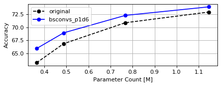
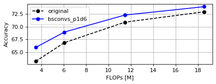

| Model                                        |   Accuracy (top-1) |   Params [M] |   FLOPs [M] |
|:---------------------------------------------|-------------------:|-------------:|------------:|
| `cifar_mobilenetv3_small_w1`                 |              72.93 |         1.15 |       18.54 |
| `cifar_mobilenetv3_small_w3d4`               |              70.87 |         0.77 |       11.46 |
| `cifar_mobilenetv3_small_w1d2`               |              66.83 |         0.49 |        6.05 |
| `cifar_mobilenetv3_small_w7d20`              |              63.16 |         0.37 |        3.50 |
|                                              |                    |              |             |
| `cifar_mobilenetv3_small_w1_bsconvs_p1d6`    |              73.93 |         1.15 |       18.54 |
| `cifar_mobilenetv3_small_w3d4_bsconvs_p1d6`  |              72.28 |         0.77 |       11.46 |
| `cifar_mobilenetv3_small_w1d2_bsconvs_p1d6`  |              68.92 |         0.49 |        6.05 |
| `cifar_mobilenetv3_small_w7d20_bsconvs_p1d6` |              65.90 |         0.37 |        3.50 |

### CIFAR100 - MobileNetV3-large

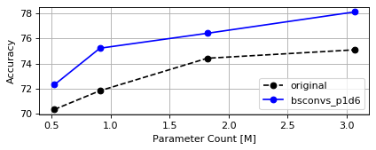
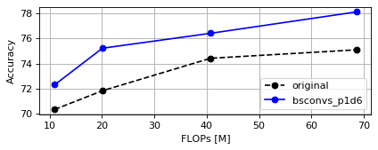

| Model                                        |   Accuracy (top-1) |   Params [M] |   FLOPs [M] |
|:---------------------------------------------|-------------------:|-------------:|------------:|
| `cifar_mobilenetv3_large_w1`                 |              75.09 |         3.07 |       68.54 |
| `cifar_mobilenetv3_large_w3d4`               |              74.42 |         1.82 |       40.75 |
| `cifar_mobilenetv3_large_w1d2`               |              71.83 |         0.91 |       20.09 |
| `cifar_mobilenetv3_large_w7d20`              |              70.34 |         0.52 |       10.98 |
|                                              |                    |              |             |
| `cifar_mobilenetv3_large_w1_bsconvs_p1d6`    |              78.11 |         3.07 |       68.54 |
| `cifar_mobilenetv3_large_w3d4_bsconvs_p1d6`  |              76.41 |         1.82 |       40.75 |
| `cifar_mobilenetv3_large_w1d2_bsconvs_p1d6`  |              75.22 |         0.91 |       20.09 |
| `cifar_mobilenetv3_large_w7d20_bsconvs_p1d6` |              72.31 |         0.52 |       10.98 |

### CIFAR100 - ResNets

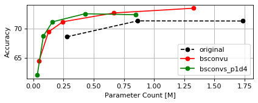


| Model                          |   Accuracy (top-1) |   Params [M] |   FLOPs [M] |
|:-------------------------------|-------------------:|-------------:|------------:|
| `cifar_resnet20`               |              68.59 |         0.28 |       41.42 |
| `cifar_resnet56`               |              71.31 |         0.86 |      127.39 |
| `cifar_resnet110`              |              71.29 |         1.74 |      256.34 |
| `cifar_resnet302`              |              72.22 |         4.85 |      714.83 |
| `cifar_resnet602`              |              71.22 |         9.71 |     1431.22 |
|                                |                    |              |             |
| `cifar_resnet20_bsconvu`       |              64.41 |         0.05 |        7.86 |
| `cifar_resnet56_bsconvu`       |              69.43 |         0.13 |       21.42 |
| `cifar_resnet110_bsconvu`      |              71.16 |         0.24 |       41.77 |
| `cifar_resnet302_bsconvu`      |              72.67 |         0.67 |      114.12 |
| `cifar_resnet602_bsconvu`      |              73.48 |         1.33 |      227.17 |
|                                |                    |              |             |
| `cifar_resnet20_bsconvs_p1d4`  |              62.03 |         0.03 |        5.66 |
| `cifar_resnet56_bsconvs_p1d4`  |              68.72 |         0.08 |       15.37 |
| `cifar_resnet110_bsconvs_p1d4` |              71.15 |         0.16 |       29.93 |
| `cifar_resnet302_bsconvs_p1d4` |              72.53 |         0.43 |       81.70 |
| `cifar_resnet602_bsconvs_p1d4` |              73.05 |         0.85 |      162.60 |

### CIFAR100 - WideResNets (WRN-16)

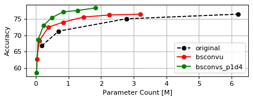
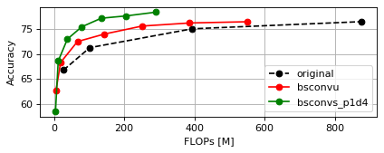

| Model                         |   Accuracy (top-1) |   Params [M] |   FLOPs [M] |
|:------------------------------|-------------------:|-------------:|------------:|
| `cifar_wrn16_1`               |              66.81 |         0.18 |       27.07 |
| `cifar_wrn16_2`               |              71.29 |         0.70 |      101.87 |
| `cifar_wrn16_4`               |              75.07 |         2.77 |      394.08 |
| `cifar_wrn16_6`               |              76.50 |         6.21 |      877.14 |
| `cifar_wrn16_8`               |              77.30 |        11.01 |     1551.03 |
| `cifar_wrn16_10`              |              77.28 |        17.17 |     2415.77 |
| `cifar_wrn16_12`              |              78.02 |        24.71 |     3471.34 |
|                               |                    |              |             |
| `cifar_wrn16_1_bsconvu`       |              62.79 |         0.03 |        5.57 |
| `cifar_wrn16_2_bsconvu`       |              68.33 |         0.11 |       18.75 |
| `cifar_wrn16_4_bsconvu`       |              72.51 |         0.39 |       66.62 |
| `cifar_wrn16_6_bsconvu`       |              74.02 |         0.84 |      143.84 |
| `cifar_wrn16_8_bsconvu`       |              75.61 |         1.45 |      250.42 |
| `cifar_wrn16_10_bsconvu`      |              76.23 |         2.24 |      386.36 |
| `cifar_wrn16_12_bsconvu`      |              76.48 |         3.20 |      551.67 |
|                               |                    |              |             |
| `cifar_wrn16_1_bsconvs_p1d4`  |              58.48 |         0.02 |        4.02 |
| `cifar_wrn16_2_bsconvs_p1d4`  |              68.62 |         0.07 |       11.86 |
| `cifar_wrn16_4_bsconvs_p1d4`  |              73.01 |         0.24 |       38.03 |
| `cifar_wrn16_6_bsconvs_p1d4`  |              75.46 |         0.49 |       78.87 |
| `cifar_wrn16_8_bsconvs_p1d4`  |              77.18 |         0.84 |      134.40 |
| `cifar_wrn16_10_bsconvs_p1d4` |              77.64 |         1.29 |      204.60 |
| `cifar_wrn16_12_bsconvs_p1d4` |              78.39 |         1.82 |      289.49 |

### CIFAR100 - WideResNets (WRN-28)

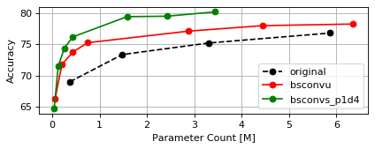
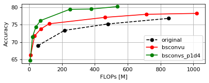

| Model                         |   Accuracy (top-1) |   Params [M] |   FLOPs [M] |
|:------------------------------|-------------------:|-------------:|------------:|
| `cifar_wrn28_1`               |              69.00 |         0.38 |       55.72 |
| `cifar_wrn28_2`               |              73.38 |         1.48 |      215.80 |
| `cifar_wrn28_3`               |              75.25 |         3.31 |      479.96 |
| `cifar_wrn28_4`               |              76.85 |         5.87 |      848.44 |
| `cifar_wrn28_6`               |              78.18 |        13.18 |     1898.42 |
| `cifar_wrn28_8`               |              78.07 |        23.40 |     3365.72 |
| `cifar_wrn28_10`              |              78.58 |        36.54 |     5250.36 |
| `cifar_wrn28_12`              |              79.04 |        52.59 |     7552.34 |
|                               |                    |              |             |
| `cifar_wrn28_1_bsconvu`       |              66.21 |         0.06 |       10.09 |
| `cifar_wrn28_2_bsconvu`       |              71.78 |         0.20 |       34.09 |
| `cifar_wrn28_3_bsconvu`       |              73.79 |         0.44 |       71.46 |
| `cifar_wrn28_4_bsconvu`       |              75.29 |         0.75 |      122.45 |
| `cifar_wrn28_6_bsconvu`       |              76.67 |         1.64 |      265.34 |
| `cifar_wrn28_8_bsconvu`       |              77.15 |         2.87 |      462.76 |
| `cifar_wrn28_10_bsconvu`      |              78.04 |         4.44 |      714.70 |
| `cifar_wrn28_12_bsconvu`      |              78.30 |         6.36 |     1021.17 |
|                               |                    |              |             |
| `cifar_wrn28_1_bsconvs_p1d4`  |              64.65 |         0.04 |        7.26 |
| `cifar_wrn28_2_bsconvs_p1d4`  |              71.55 |         0.13 |       21.48 |
| `cifar_wrn28_3_bsconvs_p1d4`  |              74.42 |         0.26 |       42.25 |
| `cifar_wrn28_4_bsconvs_p1d4`  |              76.22 |         0.43 |       69.84 |
| `cifar_wrn28_6_bsconvs_p1d4`  |              78.18 |         0.92 |      145.47 |
| `cifar_wrn28_8_bsconvs_p1d4`  |              79.49 |         1.58 |      248.36 |
| `cifar_wrn28_10_bsconvs_p1d4` |              80.09 |         2.42 |      378.52 |
| `cifar_wrn28_12_bsconvs_p1d4` |              80.26 |         3.44 |      535.94 |

### CIFAR100 - WideResNets (WRN-40)

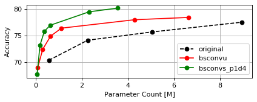
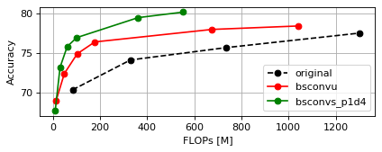

| Model                         |   Accuracy (top-1) |   Params [M] |   FLOPs [M] |
|:------------------------------|-------------------:|-------------:|------------:|
| `cifar_wrn40_1`               |              70.34 |         0.57 |       84.38 |
| `cifar_wrn40_2`               |              74.13 |         2.26 |      329.74 |
| `cifar_wrn40_3`               |              75.70 |         5.06 |      735.79 |
| `cifar_wrn40_4`               |              77.55 |         8.97 |     1302.81 |
| `cifar_wrn40_6`               |              77.41 |        20.15 |     2919.70 |
| `cifar_wrn40_8`               |              78.33 |        35.79 |     5180.42 |
| `cifar_wrn40_10`              |              78.49 |        55.90 |     8084.96 |
|                               |                    |              |             |
| `cifar_wrn40_1_bsconvu`       |              68.98 |         0.09 |       14.61 |
| `cifar_wrn40_2_bsconvu`       |              72.41 |         0.30 |       49.42 |
| `cifar_wrn40_3_bsconvu`       |              74.91 |         0.64 |      103.90 |
| `cifar_wrn40_4_bsconvu`       |              76.42 |         1.12 |      178.29 |
| `cifar_wrn40_6_bsconvu`       |              77.12 |         2.44 |      386.85 |
| `cifar_wrn40_8_bsconvu`       |              78.01 |         4.29 |      675.09 |
| `cifar_wrn40_10_bsconvu`      |              78.45 |         6.64 |     1043.03 |
|                               |                    |              |             |
| `cifar_wrn40_1_bsconvs_p1d4`  |              67.66 |         0.06 |       10.49 |
| `cifar_wrn40_2_bsconvs_p1d4`  |              73.19 |         0.18 |       31.09 |
| `cifar_wrn40_3_bsconvs_p1d4`  |              75.83 |         0.37 |       61.40 |
| `cifar_wrn40_4_bsconvs_p1d4`  |              76.97 |         0.63 |      101.66 |
| `cifar_wrn40_6_bsconvs_p1d4`  |              78.42 |         1.34 |      212.07 |
| `cifar_wrn40_8_bsconvs_p1d4`  |              79.51 |         2.32 |      362.33 |
| `cifar_wrn40_10_bsconvs_p1d4` |              80.21 |         3.56 |      552.44 |

Requirements
------------

* `Python>=3.6`
* `PyTorch>=1.0.0` (support for other frameworks will be added later)

Installation
------------

```bash
pip install --upgrade bsconv
```

Usage
-----


**[See here for PyTorch usage details](bsconv/pytorch/README.md).**

Support for other frameworks will be added later.

Please note that the code provided here is work-in-progress. Therefore, some features may be missing or may change between versions.

Change Log
----------

### 0.4.0 (2020-09-22)

* BSConv for PyTorch:
    * added support for more model architectures (see `bsconv.pytorch.get_model`)
    * added result tables and plots for ResNets, WRNs, MobileNets on CIFAR datasets
    * removed script `bin/bsconv_pytorch_list_architectures.py`, because `bsconv.pytorch.get_model` is more flexible now (see the BSConv PyTorch usage readme for available architectures)

### 0.3.0 (2020-06-16)

* BSConv for PyTorch:
    * added ready-to-use model definitions (MobileNetV1, MobileNetV2, MobileNetsV3, ResNets and WRNs and their BSConv variants for CIFAR and ImageNet/fine-grained datasets)
    * added training script for CIFAR and ImageNet/fine-grained datasets
    * added class for the StanfordDogs dataset

### 0.2.0 (2020-04-16)

* BSConv for PyTorch:
    * removed activation and added option for normalization of PW layers in BSConv-S (issue #1) (**API change**)
    * added option for normalization of PW layers in BSConv-U (**API change**)
    * ensure that BSConv-S never uses more mid channels (= M') than input channels (M) and added parameter `min_mid_channels` (= M'_min) (**API change**)
    * added model profiler for parameter and FLOP counting
    * replacer now shows number of old and new model parameters

### 0.1.0 (2020-04-08)

* first public version
* BSConv for PyTorch:
    * modules `BSConvU` and `BSConvS`
    * replacers `BSConvU_Replacer` and `BSConvS_Replacer`

Citation
--------

If you find this work useful in your own research, please cite the paper as:

    @InProceedings{Haase_2020_CVPR,
        author = {Haase, Daniel and Amthor, Manuel},
        title = {Rethinking Depthwise Separable Convolutions: How Intra-Kernel Correlations Lead to Improved {MobileNets}},
        booktitle = {The IEEE/CVF Conference on Computer Vision and Pattern Recognition (CVPR)},
        month = {June},
        year = {2020}
    }
